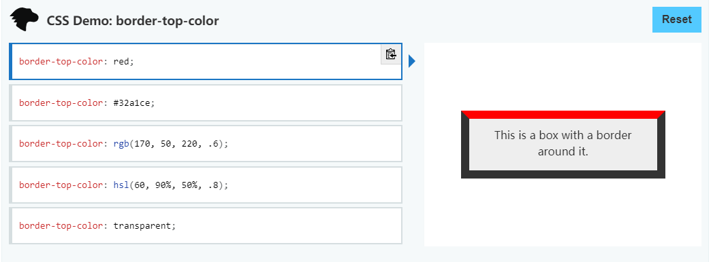

# 每日前端实战学习
教程网站：[前端每日实战](https://segmentfault.com/a/1190000014534572)
### DAY1
用纯CSS制作一个按钮文字滑动特效
#### 知识点
- ::before
- translateY
- data-*
- content
- nth-child

### DAY2
用纯CSS制作一个矩形旋转loader
#### 知识点
- @keyframes
- animation-duration
- rotateY
- ntn-child
- z-index
- ::before
- ::after

添加z-index主要是为了营造3D效果

### DAY3
用纯CSS创作一个容器厚边条纹特效
#### 知识点
- linear-gradient
- box-shadow
- @keyframes
- background-size
- background-position
- lorem ipsum

### DAY4
用纯CSS制作一个金属光泽3D按钮特效
#### 知识点
- linear-gradient
- variables
- calc
- perspective
- text-shadow
- box-shadow

### DAY5
使用CSS创作一个立体滑动toggle交互控件
#### 知识点
- linear-gradient()
- box-shadow
- calc()
- ::before
- jquery toggleClass

### DAY6
使用CSS创作一个闪闪发光的钻石
#### 知识点
- variables
- border-width
- border-color
- grid-template-column
- rotate()

### DAY7
使用CSS制作一个3D文字跑马灯特效
#### 知识点
- [transform-origin](https://developer.mozilla.org/zh-CN/docs/Web/CSS/transform-origin)
- [perspective](https://developer.mozilla.org/zh-CN/docs/Web/CSS/perspective)
- [rotateY](https://developer.mozilla.org/en-US/docs/Web/CSS/transform-function/rotateY)
- [animation-delay](https://developer.mozilla.org/zh-CN/docs/Web/CSS/animation-delay)

### DAY8
使用CSS制作一个充电loader特效
#### 知识点
- [linear-gradient()](https://developer.mozilla.org/zh-CN/docs/Web/CSS/linear-gradient)
- [background-size](https://developer.mozilla.org/zh-CN/docs/Web/CSS/background-size)
- [background-position](https://developer.mozilla.org/zh-CN/docs/Web/CSS/background-position)
- [steps()](https://developer.mozilla.org/en-US/docs/Web/CSS/single-transition-timing-function#Timing_functions)
- [currentColor](https://developer.mozilla.org/zh-CN/docs/Web/CSS/color_value#currentColor_%E5%85%B3%E9%94%AE%E5%AD%97)
- [border-radius](https://developer.mozilla.org/zh-CN/docs/Web/CSS/border-radius)

### DAY9
使用CSS制作一个按钮被瞄准的交互特效
#### 知识点
- [:not](https://developer.mozilla.org/zh-CN/docs/Web/CSS/:not)
- [:first-child](https://developer.mozilla.org/zh-CN/docs/Web/CSS/:first-child)
- [:filter functions](https://developer.mozilla.org/zh-CN/docs/Web/CSS/filter)
- [animation-direction](https://developer.mozilla.org/zh-CN/docs/Web/CSS/animation-direction)

### DAY10
使用CSS制作一个同心旋转loader特效
#### 知识点
- [border-left-color](https://developer.mozilla.org/zh-CN/docs/Web/CSS/border-left-color)
- [border-right-color](https://developer.mozilla.org/zh-CN/docs/Web/CSS/border-right-color)
- [border-top-color](https://developer.mozilla.org/zh-CN/docs/Web/CSS/border-top-color)
- [border-bottom-color](https://developer.mozilla.org/zh-CN/docs/Web/CSS/border-bottom-color)
- [animation-duration](https://developer.mozilla.org/zh-CN/docs/Web/CSS/animation-duration)

### DAY11
使用CSS制作一个荧光脉冲loader特效
#### 知识点
- [variable](https://developer.mozilla.org/en-US/docs/Web/CSS/CSS_Variables)
- [calc](https://developer.mozilla.org/zh-CN/docs/Web/CSS/calc)
- [animation-timing-function](https://developer.mozilla.org/zh-CN/docs/Web/CSS/animation-timing-function)
- [filter](https://developer.mozilla.org/zh-CN/docs/Web/CSS/filter)
- [box-shadow](https://developer.mozilla.org/zh-CN/docs/Web/CSS/box-shadow)

### DAY12
使用CSS制作一个文字断开交互特效
#### 知识点
- [data-*](https://developer.mozilla.org/zh-CN/docs/Web/HTML/Global_attributes/data-*)
- [clip-path](https://developer.mozilla.org/zh-CN/docs/Web/CSS/clip-path)
- [shape functions](https://developer.mozilla.org/zh-CN/docs/Web/CSS/basic-shape)
- [rotate](https://developer.mozilla.org/zh-CN/docs/Web/CSS/transform-function/rotate)
- [::before](https://developer.mozilla.org/zh-CN/docs/Web/CSS/::before)
- [::after](https://developer.mozilla.org/zh-CN/docs/Web/CSS/::after)

### DAY13
使用纯CSS制作一个冒着热气的咖啡杯特效
#### 知识点
- [border-bottom-left-radius](https://developer.mozilla.org/zh-CN/docs/Web/CSS/border-bottom-left-radius)
- [border-bottom-left-radius](https://developer.mozilla.org/en-US/docs/Web/CSS/border-bottom-right-radius)
- [box-shadow](https://developer.mozilla.org/zh-CN/docs/Web/CSS/box-shadow)
- [calc()](https://developer.mozilla.org/zh-CN/docs/Web/CSS/calc)
- [translateY()](https://developer.mozilla.org/zh-CN/docs/Web/CSS/transform-function/translateY)
- [filter](https://developer.mozilla.org/zh-CN/docs/Web/CSS/filter)
- [animation-delay](https://developer.mozilla.org/zh-CN/docs/Web/CSS/animation-delay)

### DAY14
使用CSS制作一个侧立图书效果
#### 知识点
- [justify-content](https://developer.mozilla.org/en-US/docs/Web/CSS/justify-content)
- [skewY()](https://developer.mozilla.org/en-US/docs/Web/CSS/transform-function/skewY)
- [skewX()](https://developer.mozilla.org/en-US/docs/Web/CSS/transform-function/skewX)
- [transform-origin](https://developer.mozilla.org/en-US/docs/Web/CSS/transform-origin)
- [brightness()](https://developer.mozilla.org/en-US/docs/Web/CSS/filter-function/brightness)

### DAY15
纯CSS制作条形图，不使用任何图形库
#### 知识点
- [linear-gradient()](https://developer.mozilla.org/en-US/docs/Web/CSS/linear-gradient)
- [translateY()](https://developer.mozilla.org/en-US/docs/Web/CSS/transform-function/translateY)
- [background-image](https://developer.mozilla.org/en-US/docs/Web/CSS/background-image)
- [background-repeat](https://developer.mozilla.org/en-US/docs/Web/CSS/background-repeat)
- [background-position](https://developer.mozilla.org/en-US/docs/Web/CSS/background-position)
- [background-size](https://developer.mozilla.org/en-US/docs/Web/CSS/background-size)

### DAY16
纯CSS制作一个渐变色动画边框特效
#### 知识点
- [z-index](https://developer.mozilla.org/en-US/docs/Web/CSS/z-index)
- [background-image](https://developer.mozilla.org/en-US/docs/Web/CSS/background-image)
- [background-size](https://developer.mozilla.org/en-US/docs/Web/CSS/background-size)
- [background-position](https://developer.mozilla.org/en-US/docs/Web/CSS/background-position)

### DAY17
纯CSS制作炫酷的同心矩阵旋转动画
#### 知识点
- [border-color](https://developer.mozilla.org/en-US/docs/Web/CSS/border-color)
- [calc()](https://developer.mozilla.org/en-US/docs/Web/CSS/calc)
- [rotate()](https://developer.mozilla.org/en-US/docs/Web/CSS/transform-function/rotate)
- [animation-delay](https://developer.mozilla.org/en-US/docs/Web/CSS/animation-delay)
- [box-sizing](https://developer.mozilla.org/en-US/docs/Web/CSS/box-sizing)
- **一些专家甚至建议所有的Web开发者将所有的元素的box-sizing都设置为border-box**

### DAY18
纯CSS制作404文字变形为NON文字的特效
#### 知识点
- [opacity](https://developer.mozilla.org/en-US/docs/Web/CSS/filter#Functions)
- [nth-child()](https://developer.mozilla.org/en-US/docs/Web/CSS/:nth-child)
- [transition](https://developer.mozilla.org/en-US/docs/Web/CSS/transition)

### DAY19
纯CSS制作一种有削铁如泥感觉的菜单导航特效
#### 知识点
- [border-top](https://developer.mozilla.org/en-US/docs/Web/CSS/border-top)
- [content](https://developer.mozilla.org/en-US/docs/Web/CSS/content)
- [attr](https://developer.mozilla.org/en-US/docs/Web/CSS/attr)
- [clip-path](https://developer.mozilla.org/en-US/docs/Web/CSS/clip-path)
- [transition-delay](https://developer.mozilla.org/en-US/docs/Web/CSS/transition-delay)
- [nth-child()](https://developer.mozilla.org/en-US/docs/Web/CSS/:nth-child#Syntax)

### DAY20
纯CSS为母亲节创作一颗像素风格的爱心
#### 知识点
- [grid-template-columns](https://developer.mozilla.org/en-US/docs/Web/CSS/grid-template-columns)
- [grid-gap](https://developer.mozilla.org/en-US/docs/Web/CSS/grid-gap)
- [:nth-of-type()](https://developer.mozilla.org/en-US/docs/Web/CSS/:nth-of-type)
- [animation-delay](https://developer.mozilla.org/en-US/docs/Web/CSS/animation-delay)
- [translateY()](https://developer.mozilla.org/en-US/docs/Web/CSS/transform-function/translateY)
- [filter](https://developer.mozilla.org/en-US/docs/Web/CSS/filter)

### DAY21
纯CSS创作文本滑动特效的UI界面
#### 知识点
- [rotate](https://developer.mozilla.org/en-US/docs/Web/CSS/transform-function/rotate)
- [filter](https://developer.mozilla.org/en-US/docs/Web/CSS/filter)
- [transition](https://developer.mozilla.org/en-US/docs/Web/CSS/transition)

### DAY22
纯CSS创作出美丽的彩虹条纹文字
#### 知识点
- [content](https://developer.mozilla.org/en-US/docs/Web/CSS/content)
- [attr()](https://developer.mozilla.org/en-US/docs/Web/CSS/attr)
- [calc()](https://developer.mozilla.org/en-US/docs/Web/CSS/calc)
- [z-index](https://developer.mozilla.org/en-US/docs/Web/CSS/z-index)
- [:nth-child()](https://developer.mozilla.org/en-US/docs/Web/CSS/:nth-child)

### DAY23
纯CSS创作一个菜单反色填充特效
#### 知识点
- [mix-blend-mode](https://developer.mozilla.org/en-US/docs/Web/CSS/mix-blend-mode)
- [var()](https://developer.mozilla.org/en-US/docs/Web/CSS/var)
- [calc()](https://developer.mozilla.org/en-US/docs/Web/CSS/calc)

### DAY24
纯CSS创作出平滑的层叠海浪特效
### 原理
使用三个正方形，border设置为43%，旋转360度，每个的旋转速度不一致，即可实现。

### DAY29
不使用transition和animation也能做网页动画
#### 不清楚的地方
- [perspective](https://developer.mozilla.org/en-US/docs/Web/CSS/perspective)
- [transform](https://developer.mozilla.org/zh-CN/docs/Web/CSS/transform)
1. perspective: 三维透视
2. transform:

### DAY 37
如何把握好transition和animation的时序，创作描边按钮特效

#### 知识点
- [transition](https://developer.mozilla.org/zh-CN/docs/Web/CSS/transition)

transition: 过渡，可以与 transform 搭配使用

```css
nav ul li:hover::before {
    transition:
        visibility 0s,
        width linear var(--t1x),
        height linear var(--t1x) var(--t1x);
}
```

### DAY 42
创作一个均衡器loader动画

#### 知识点
- [clip-path](https://developer.mozilla.org/zh-CN/docs/Web/CSS/clip-path)

```css
.clip{
    clip-path: inset(10% 0 0 0);
}
``` 
inset中的值就如同padding的值一样，属于内部切割。

### DAY 43
CSS绘制一个充满动感的Vue logo

#### 知识点
- [border-top-color](https://developer.mozilla.org/en-US/docs/Web/CSS/border-top-color)

```css
.outer, .middle, .inner {
    position: absolute;
    border-style: solid;
    /*border-color: var(--c);*/
    border-color: transparent;
    border-top-width: var(--h);
    border-top-color: var(--c);
    border-left-width: calc(var(--w) / 2);
    /*border-left-color: transparent;*/
    border-right-width: calc(var(--w) / 2);
    /*border-bottom-color: transparent;*/
    /*border-bottom-width: var(--h);*/
}
```

根据MDN上的演示效果及实际运行效果，可以通过设置border的宽度创建三角形



### DAY45 
纯CSS创作一个菱形 loader 动画

#### 知识点
- [grid MDN](https://developer.mozilla.org/zh-CN/docs/Web/CSS/grid)
- [grid 网格线](https://www.html.cn/archives/8510)

`grid`是一个CSS简写属性,可以用来设置显式网格属性和隐式网格属性.

```css
.loader {
    width: 10em;
    height: 10em;
    display: grid;
    grid-template-columns: repeat(3, 1fr);
    grid-gap: 0.5em;
}
```

`grid-grap`里面item之间的间距.

`grip-template`定义网格的行和列,如果定义包含多个重复值,则使用 `repeat()` 来简化定义.

`fr` 单元允许使用等分网格容器剩余的可用空间来设置 网格轨道(Grid Track) 的大小.剩余可用空间是
除去所有非灵活网格项之后计算得到的.在下面这个例子中,可用空间减去50px后,再给 `fr` 单元的值3等分.

```css
.container {
    grid-template-columns: 1fr 50px 1fr 1fr;
}
```

### DAY48
纯CSS创作一盘蚊香

#### 知识点
- [border-radius](https://developer.mozilla.org/zh-CN/docs/Web/CSS/border-radius)

语句

```css
.coil span:nth-child(odd) {
    border-radius: 50% 50% 0 0 / 100% 100% 0 0;
}

.coil span:nth-child(even) {
    border-radius: 0 0 50% 50% / 0 0 100% 100%;
}

/*把一般框线放置到上方*/
.coil span:nth-child(odd) {
    align-self: flex-end;
}
```

解释

```css
.example {
    border-radius: 1em/5em;
    
    /* 等价于： */
    
    border-top-left-radius:     1em 5em;
    border-top-right-radius:    1em 5em;
    border-bottom-right-radius: 1em 5em;
    border-bottom-left-radius:  1em 5em;
}
```

```css
.example {
    border-radius: 4px 3px 6px / 2px 4px;
    
    /* 等价于： */
    
    border-top-left-radius:     4px 2px;
    border-top-right-radius:    3px 4px;
    border-bottom-right-radius: 6px 2px;
    border-bottom-left-radius:  3px 4px;
}
```

解释 `align-self` 为什么会变成框线在位置上方。

可能是因为使用了 `position:absolute` 属性.

```css
.coil span {
    position: absolute;
    width: calc((var(--n) * 2 - 1) * 1em);
    height: calc((var(--n) - 0.5) * 1em);
    border: 1em solid darkgreen;
}
```

### DAY50
纯CSS创作一个永动的牛顿摆

#### 知识点
- [cubic-bezier](https://developer.mozilla.org/zh-CN/docs/Web/CSS/timing-function)

```css
/*最后，让最右侧的摆线晃动*/
.loader span:last-child {
    animation: moving-up 0.75s cubic-bezier(0.215, 0.61, 0.355, 1) infinite alternate;
    animation-delay: 0.75s;
    --direction: -1;
}
```


cubic-bezier()是CSS的一个定时函数，它定义了一条[立方贝塞尔函数(cubic Bezier curve)](https://en.wikipedia.org/wiki/B%C3%A9zier_curve),
就是像钢笔画调曲线，这些曲线是连续的，一般用于动画的平滑变换，也被称为缓动函数(easing functions)。

一条立方贝塞尔曲线需要四个点来定义，P0 、P1 、P2 和 P3。P0 和 P3 是起点和终点，这两个点被作为比例固定在坐标系上，横轴为时间比例，纵轴为完成状态。
P0 是 (0, 0)，表示初始时间和初始状态。P3 是 (1, 1) ，表示终止时间和终止状态。

语法

> `cubic-bezier(x1, y1, x2, y2)`

CSS还支持一个定时函数:**steps()阶梯函数**

| 图片 | 图片 |
| ---- | --- |
| .png) | .png) |
| steps(2,start) | steps(4,end) |

### DAY51
纯CSS创作一个雷达扫描动画

#### 知识点
- [linear-gradient()](https://developer.mozilla.org/en-US/docs/Web/CSS/linear-gradient)
- [repeating-radial-gradient()](https://developer.mozilla.org/en-US/docs/Web/CSS/repeating-radial-gradient)

linear-gradient()是线性渐变，repeating-radial-gradient()是重复径向渐变

```css
/*在背景上画出4个同心圆*/
.radar {
    background:
        repeating-radial-gradient(
            transparent 0,
            transparent 0.95em,
            darkgreen 0.95em,
            darkgreen 1em),
        linear-gradient(black, black);
}
```

### DAY54
纯CSS创作一副国际象棋

#### 知识点

- [display-CSS-TRICKS](https://css-tricks.com/almanac/properties/d/display/)
- [display-MDN](https://developer.mozilla.org/zh-CN/docs/Web/CSS/display)

### DAY60

纯CSS创作一块乐高积木

#### 知识点

- [filter 滤镜](https://developer.mozilla.org/zh-CN/docs/Web/CSS/filter)